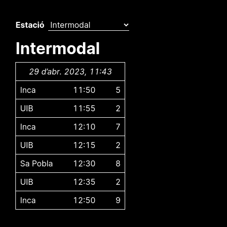

# SFM++

SFM++ is an online timetable which (tries to) mimic the "official" timetable
shown at stations of SFM (Serveis Ferroviaris de Mallorca).

The current version is mostly feature-complete (though lacking in robustness).
Right now, you can self-host the server, but no public instance is available.
If you know of any (free) hosting, a comment would be highly appreciated.

## Usage and dependencies

### TL;DR

Run these commands:

    # only if you haven't cloned already
    git clone https://github.com/jjzn/sfm-plus.git
    cd sfm-plus

    cargo run

### The long story

The dependencies for the Rust server are listed in `Cargo.toml`. However, the
server also depends on some external libraries, both of which can be installed
using your system's package manager:
- Tesseract 4 (a known working version is `4.1.1`)
- OpenCV
- clang and libclang (`libclang-dev` for Debian and derivatives)

Please refer to [this page](https://github.com/twistedfall/opencv-rust#getting-opencv)
for further instructions regarding how to install system dependencies.

After having installed these two external dependencies, you can use the usual
Cargo commands to build and optionally start the server (`cargo build` and
`cargo run`).

If you plan on hosting an instance of SFM++, keep in mind this project is
licensed under the [GNU Affero General Public License](https://choosealicense.com/licenses/agpl-3.0/),
which means that you must disclose the source of any instances you host. For a
more complete overview, visit the link above or read the [`LICENSE`](./LICENSE).

## Testing

Test data, which includes images and transcriptions in JSON format, are
included in [`test/`](./test). The tests compare the output of the extractor
with a manual transcription of the corresponding image. They can be run by
invoking `cargo test`.

## Roadmap and To-do

- [ ] Only re-render the table after data has been fetched from the server
- [ ] Reduce time spent on data extraction in the server
- [ ] Add support for other transit agencies (TIB, EMT)
